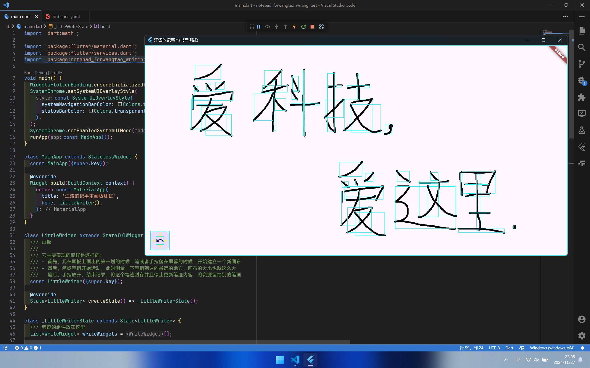
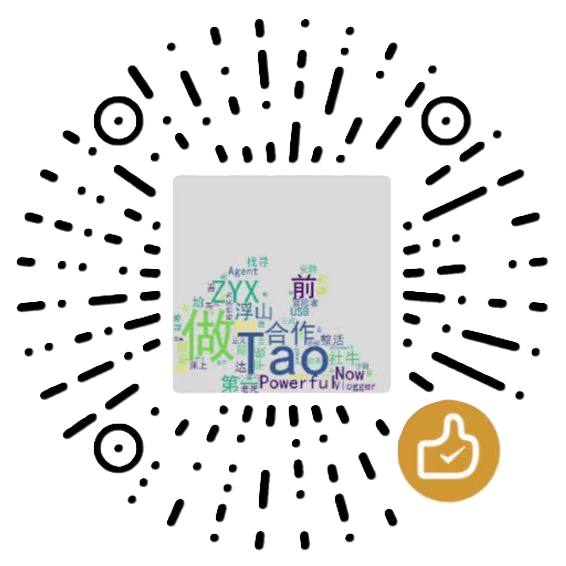

<h1 style="text-align: center;">书写板组件</h1>

```dart

```

"汪涛的记事本"中书写组件的核心,简单又好用

<!---->

---

<div style="text-align: center; margin: 0 auto; width: 500;">


</div>

> [!NOTE]
> “汪涛的记事本”是我做的第一个大项目,我会努力做好的!\
> 下面是它的目录:\
> 应用:\
> 1.[Android版 Material风格](https://github.com/TaoEngine/notepad_forwangtao_android) ✊正在做\
> 2.[iOS版 Cupertino风格](https://github.com/TaoEngine/notepad_forwangtao_android) ❎未着手\
> 3.[HarmonyOS NEXT版 ArkUI风格](https://github.com/TaoEngine/notepad_forwangtao_android) ❎未着手\
> 4.[Windows版 Fluent风格](https://github.com/TaoEngine/notepad_forwangtao_android) ❎未着手\
> 5.[Linux版 GTK风格](https://github.com/TaoEngine/notepad_forwangtao_android) ❎未着手\
> 6.[墨水屏版 高对比度风格](https://github.com/TaoEngine/notepad_forwangtao_android) ❎未着手\
> 7.[Web版 Material风格](https://github.com/TaoEngine/notepad_forwangtao_android) ❎未着手\
> 7.[独立系统版 单应用 Material风格](https://github.com/TaoEngine/notepad_forwangtao_android) ❎未着手\
> 8.[服务器版 无头应用 同步服务器/笔记处理服务器/备份服务器](https://github.com/TaoEngine/notepad_forwangtao_android) ❎未着手\
> 组件:\
> 1.[书写板组件](https://github.com/TaoEngine/notepad_forwangtao_android) ✊正在做\
> 2.[识别组件](https://github.com/TaoEngine/notepad_forwangtao_android) ❎未着手\
> 3.[同步组件](https://github.com/TaoEngine/notepad_forwangtao_android) ❎未着手

## 简介

前情提要下,
在主线“汪涛的记事本”中,
我可是详细提了下我期望的记事本的形状,
它应该是传统手写与现代富文本结合的记事本,
在我书写时提供便捷的功能让我沉浸手写并且能在我写完复盘时对我书写后的内容进行编辑

> [!NOTE]
> 强调一下,就像编辑富文本一样便捷哦

苹果的备忘录就是个好例子,
沉浸书写的时候感觉就像在一张纸上写字,
编辑也很方便
虽然没达到我心目中的要求,
我最期望的是记事本编辑手写文字就跟编辑 Word 那样长按框选,
还能全选某一段那样的

> [!NOTE]
> 注：我说的是 iOS18 之前的备忘录\
> 18 之后的备忘录加了个非常容易打断书写的“数学笔迹识别”工具,最关键的是它把框选文字的逻辑给改了 😥

因此我着重在这个书写板组件上强调一下书写笔迹的写后处理
- 提供了直接访问书写板笔迹的接口
- 有一些关于如何处理这些笔迹的位置、行距、框选操作
- 能结合机器学习的方法将这些笔迹通过类似于手写输入法识别笔迹的方式将一连串的笔迹提前处理成文本
> 这样在后期的像记事本内容搜索啊、记事本内容记忆功能啊操作起来也有理有据

为了不和之前写的页面代码打架,同时也为了跨端做准备,我还是把书写功能剥离出来做成模块吧,这样新增修改功能也简单方便

## 任务

- [x] 将笔迹记录为模块并附带存储的回调函数
- [x] 书写板的背景,比如条纹,横线或者点,背景将严格用于手写文字的排版
- [x] 像苹果备忘录一样的无限向下手写笔记
- [ ] 提供对手写笔迹的风格化调整,支持调整内置的中性笔、水笔、荧光笔和橡皮擦的各类参数
- [ ] 对笔迹进行排版,并提供类似于文字选择器一样的手写文字选择器用于选择或者全选
- [ ] 识别笔迹是什么文字并提前存储以备后端使用
- [ ] 将笔迹分类,哪些是手写字,哪些是图画,哪些是格式化用的符号（类似于 markdown,但是比 markdown 写起来简单）

## 使用

虽然我的这个组件是专门为我的记事本应用而写的,但我非常高兴你们能将此模块用在自己的项目上

这个模块是通用的,调用起来很简单,书写板的 Widget 名叫 `Writingboard()` ,将它导入到你想要书写的 `Page` 上就好了

```dart
Writingboard({Key? key, required List<Widget> writeWidgets})
```

其中 `writeWidgets` 是书写的笔迹,以 `WriteWidget` 进行存储
其他功能的参数文档还在完善,敬请期待吧!

## 关注&捐赠

<table style="text-align: center; margin: 0 auto; width: 500;">
    <tr>
        <th>
          
        </th>
        <th>
          
        </th>
    </tr>
    <tr>
        <td>
          <p>
            觉得我做的东西有点意思,<br>
            要不趁机认识一下我?
          </p>
        </td>
        <td>
        <p>
          虽然我觉得项目很小众,<br>
          但是如果你能慷慨捐赠<br>
          我将会更有动力的
        </p>
        </td>
    </tr>
</table>